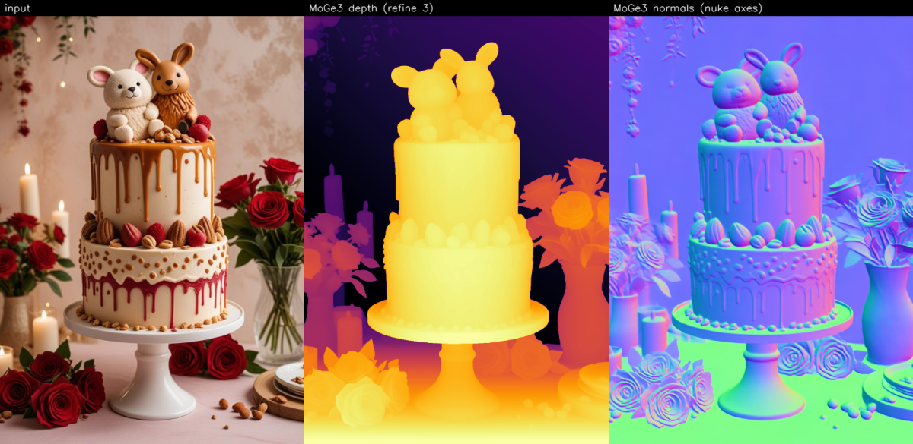

# MoGe-nuke

Monocular depth and normals in Nuke from [MoGe-3](https://github.com/microsoft/MoGe)
(Microsoft, ViT-G, 1.25 B parameters), running the **complete** model with its
sparse volumetric refiner, as a normal pull-based node: connect it, view it,
done. No baking, no render button.



**How it works.** MoGe-3's refiner is built on Triton kernels that are
JIT-compiled from Python, so it cannot live inside Nuke's own libtorch or a
`.cat` file. Instead the model runs once, resident on the GPU, in a small
Python daemon; the Nuke node is an OFX plugin that sends each frame to it over
localhost and gets depth, normals and a validity mask back. The daemon is
started automatically on first use and shuts down when Nuke does.

## Requirements

* Windows 10/11, NVIDIA GPU with 12 GB+ VRAM (tested: RTX 5090, Nuke 17.1).
  Any Nuke version with OFX 1.4 support should work (Nuke 13+).
* [uv](https://docs.astral.sh/uv/) and [Git for Windows](https://git-scm.com/)
  on PATH.
* NVIDIA driver matching the torch CUDA build you pick (default `cu128`
  needs driver 570+). RTX 50-series needs `cu128` or newer.
* Optional: Visual Studio 2022 with the C++ workload, to build the plugin
  yourself. A prebuilt `MoGe3.ofx` is included.

## Install

```powershell
git clone https://github.com/sumitchatterjee13/MoGe-nuke.git
cd MoGe-nuke
powershell -ExecutionPolicy Bypass -File install.ps1
```

The installer

1. creates `.venv` (Python 3.12) with torch + MoGe + Triton (`-Cuda cu126|cu128|cu130`
   picks the torch wheel index),
2. downloads the checkpoint (about 5 GB) to `models/moge-3-vitg.pt`
   (`-SkipModel` to let the daemon fetch it from Hugging Face on first use),
3. builds the OFX plugin if VS is present, otherwise uses `ofx/prebuilt`, and
   copies it to the first writable of: `%OFX_PLUGIN_PATH%`,
   `C:\Program Files\Common Files\OFX\Plugins`, `~\.nuke\OFXPlugins`
   (setting the user `OFX_PLUGIN_PATH` when needed),
4. adds `nuke/` to `~/.nuke/init.py` so the menu appears.

Restart Nuke. **Nodes > ML > MoGe3 > Depth + Normals**. Connect an image and
view the node. The first frame starts the daemon (a minimised console window)
and loads the model, 15-60 s; after that a 1080p frame takes about a second.

## The node

| MoGe tab | |
|---|---|
| model | local `.pt` / `.safetensors`, or a Hugging Face repo id |
| output | **depth**: RGB = metric depth, A = mask. **normals**: RGB = normal, A = mask |
| refine steps | 0 (refiner off) to 5. 3 is MoGe's default. Depth only; normals are identical at every setting |
| resolution level | 0-9, detail vs speed. Ignored when num tokens > 0 |
| num tokens | ViT tokens, 1200-3600 trained range. 0 = from resolution level |
| lock fov x | degrees; 0 = estimated per frame. Only rescales depth |
| fp16 | mixed precision |
| input colorspace | **scene-linear** (default; Nuke's working space, encoded to sRGB for the model) or **already sRGB** |
| normal space | **nuke**: x right, y up, z toward camera. **opencv**: raw MoGe axes |
| apply mask | zero depth/normals where the model marks pixels invalid (sky). The mask is always in alpha |

| Setup tab | |
|---|---|
| python / daemon script | the venv interpreter and `daemon/moge_daemon.py`; filled in by the installer |
| port | 47821 |
| auto-start daemon | launch the daemon when nothing answers on the port |
| daemon exits with Nuke | default on: frees the GPU when Nuke closes or crashes. Off keeps the model resident across sessions |

Depth is metric (scene units as the model estimates them). Normals in `nuke`
space drop straight into relighting setups (`N . L` with L in camera space).

Both passes come from one inference, so switching `output` is free. The
reply is cached per node on the source pixels and the inference knobs.

## Daemon

`daemon/moge_daemon.py` is a plain TCP server you can also drive yourself:

```
.venv\Scripts\python daemon\moge_daemon.py            # foreground, default port
.venv\Scripts\python daemon\moge_client.py info
.venv\Scripts\python daemon\moge_client.py infer image.png --out result.exr
.venv\Scripts\python daemon\moge_client.py shutdown
```

Nuke menu: **MoGe3 > Daemon > Start / Status / Stop**. The wire protocol is
documented at the top of `moge_daemon.py`; `moge_client.py` is the reference
client.

## Building the plugin

```powershell
powershell -ExecutionPolicy Bypass -File ofx\build.ps1
```

Raw OFX C API against the headers in `ofx/include/openfx`; no other
dependencies. Output lands in `ofx/build/MoGe3.ofx.bundle`. Close Nuke before
reinstalling (it locks the loaded `.ofx`).

The plugin finds the repo through `moge3.cfg` next to the `.ofx` (written by
the installer) or the `MOGE_NUKE_ROOT` environment variable. Without either,
fill in the Setup tab by hand.

## Notes and limits

* Each new frame blocks the Viewer for the inference time (OFX renders are
  synchronous). Nuke caches the result afterwards.
* Per-frame inference: depth can drift slightly frame to frame on video
  (mostly global scale/shift). Normals are stable and refiner-independent.
* Refine steps > 0 is not bit-exact run to run (about 0.7 % in depth).
* A daemon started with "exits with Nuke" belongs to the Nuke session that
  launched it; a second session restarts it when that one closes.
* Tests: `daemon/test_moge_daemon.py` (venv) and `ofx/test_nuke_render.py`
  (`Nuke -t`).

## Licence

MIT (see `LICENSE`). MoGe is Copyright (c) Microsoft Corporation, MIT; the
OpenFX headers are BSD-3-Clause. See `THIRD_PARTY_NOTICES.md`. Model weights
come from Hugging Face under their own terms.
